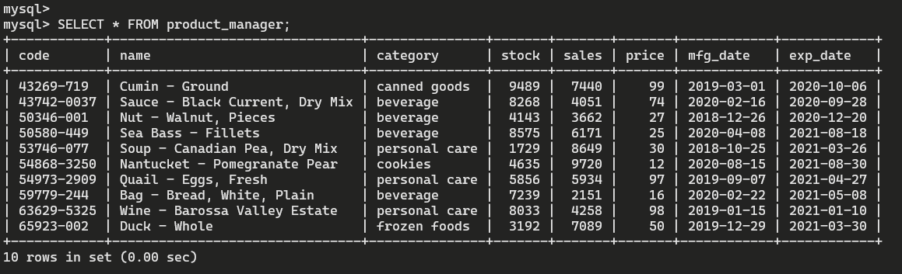

### Tạo bảng product_manager
#### Connect với DB từ command line
    docker exec -it learn-mysql /bin/bash
    mysql -u <username> -p<password>
#### Create database & table

#### Check data type

#### Insert data from Mockaroo

#### Check result
