### CREATE DATABASE LIBRARY
#### Design:
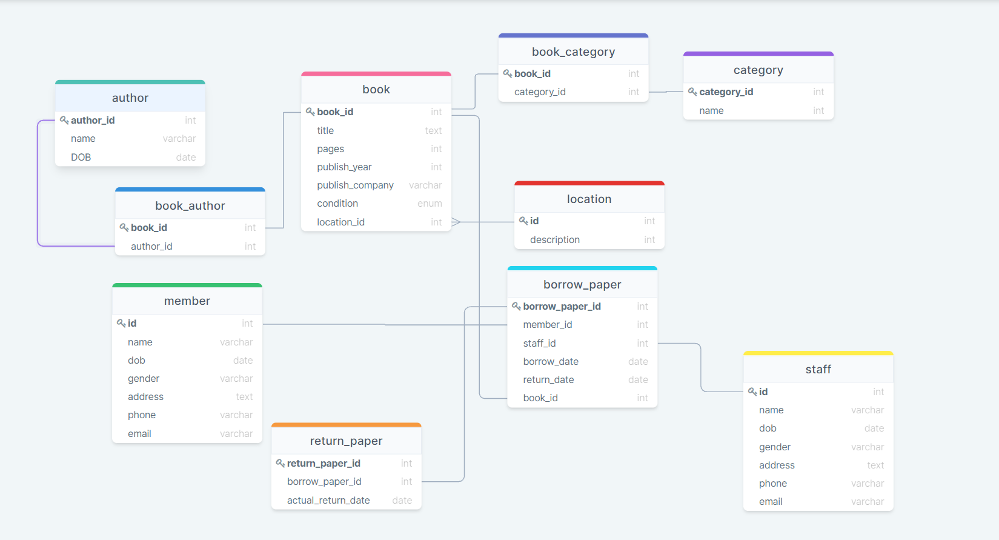

### Create table
1. book
- Add location_id làm reference sau khi tạo bảng location (tại vì chưa tạo bảng location)
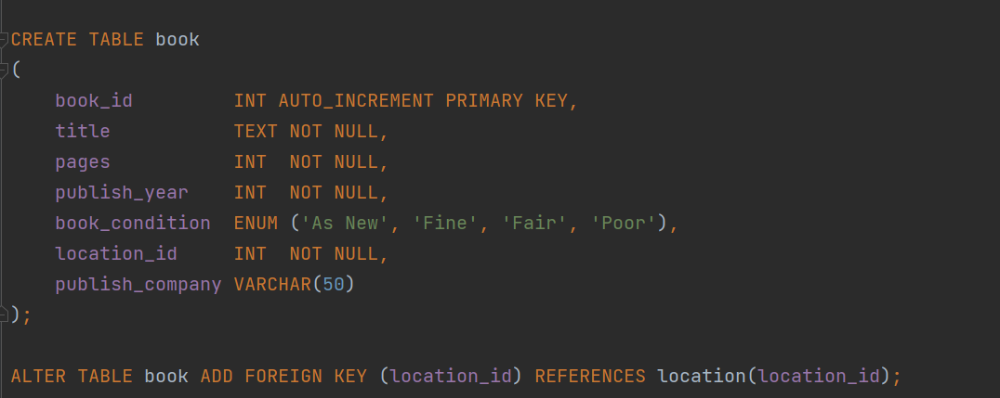
  
2. author

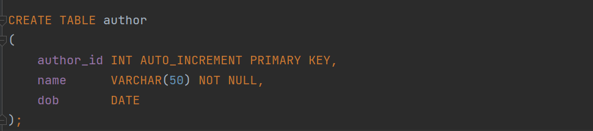
  
3. book_author

  
4. category

  
5. book_category

  
6. staff

  
7. member

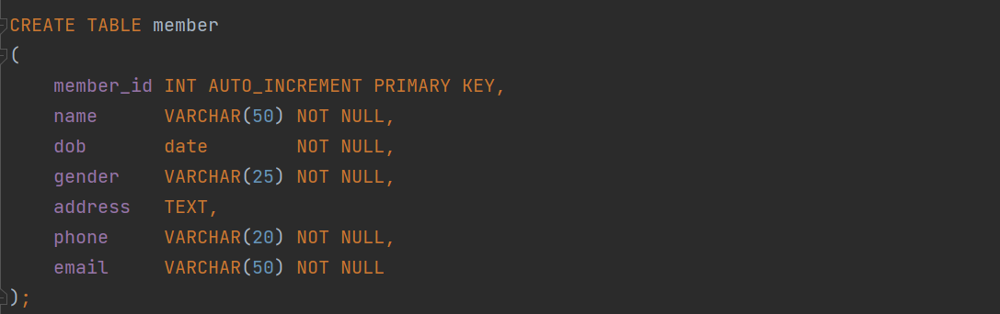
  
8. borrow_paper

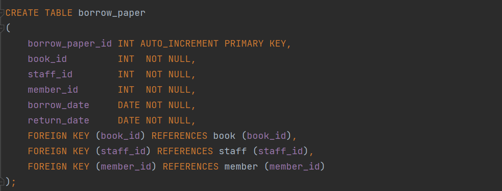
  
9. return_paper

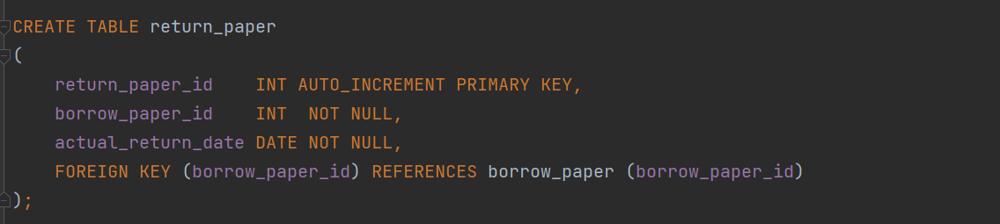
  
10. location

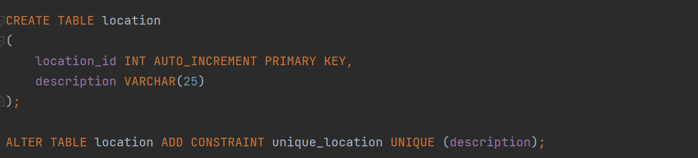
  

11. UML Diagram

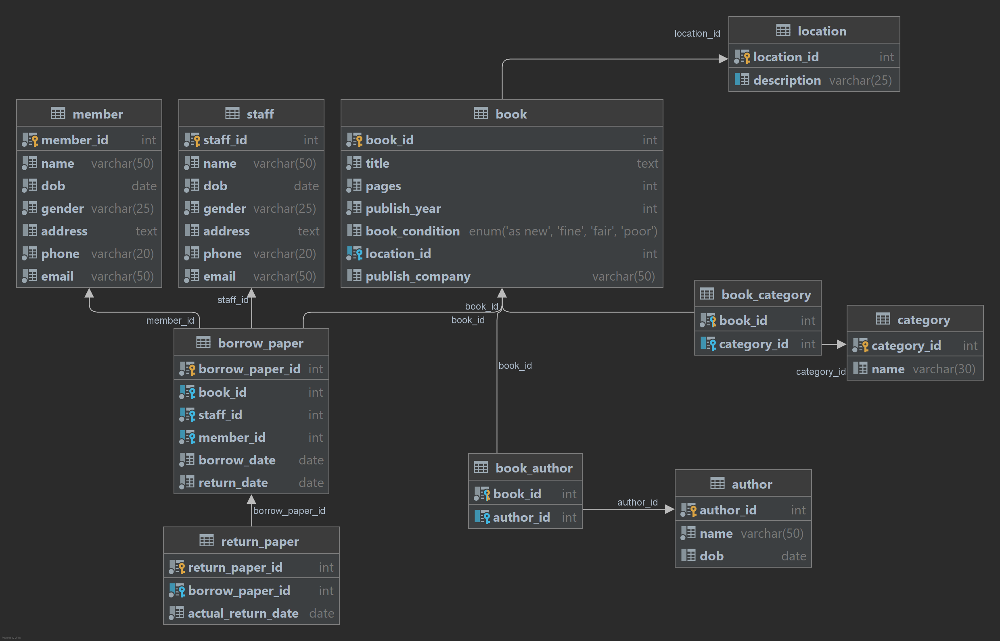
  
12. Test (Đã insert data)
- borrow_paper, book, member, staff
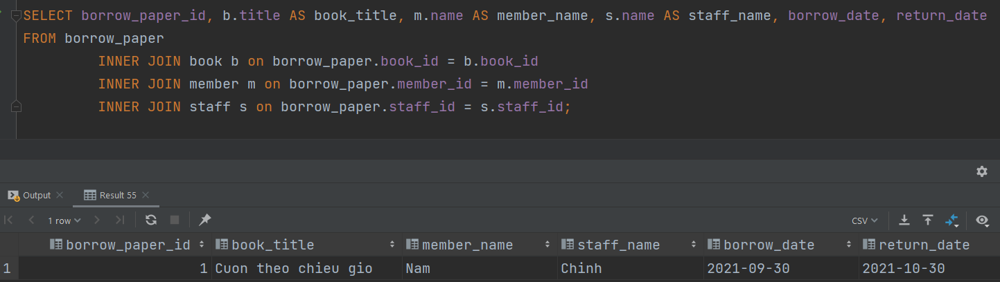
    
- book, location
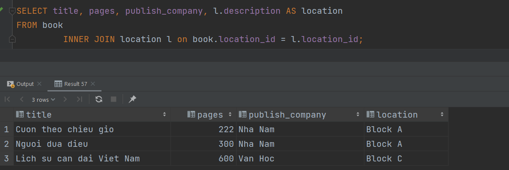
    
- book, author, category
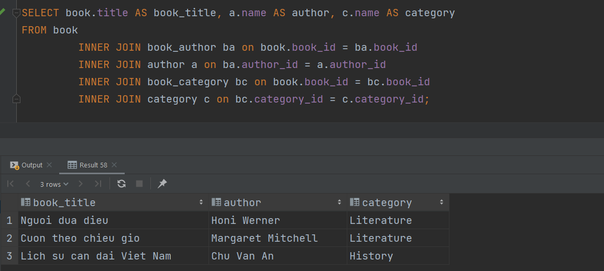
