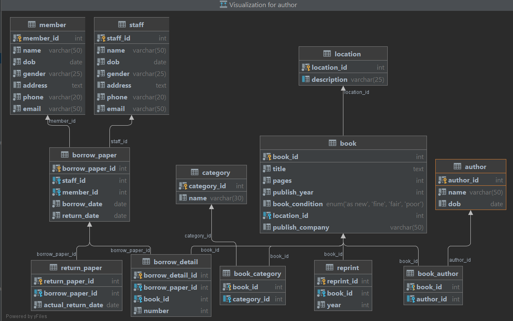
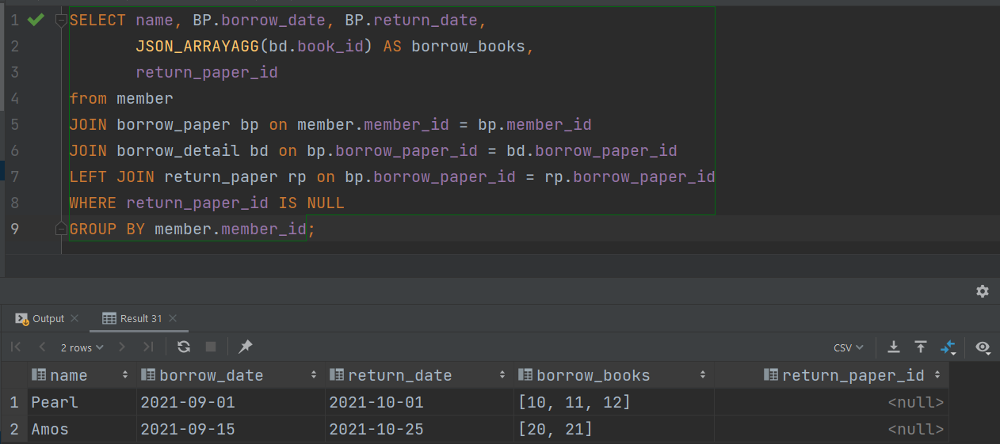
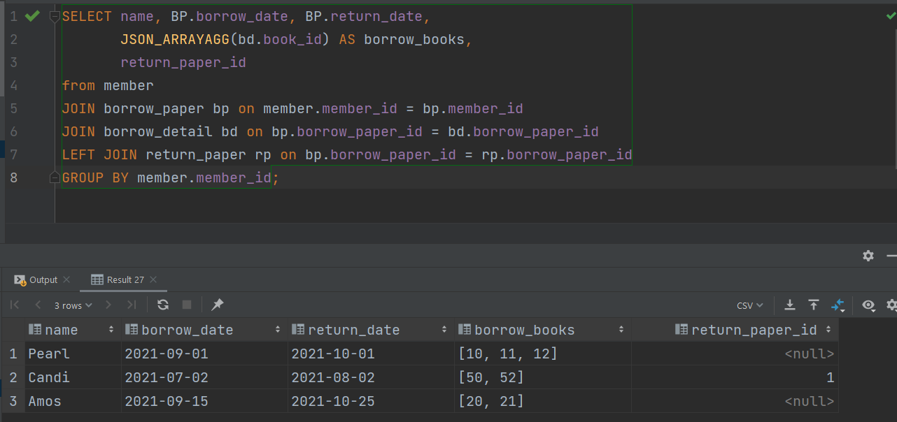
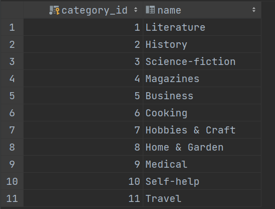
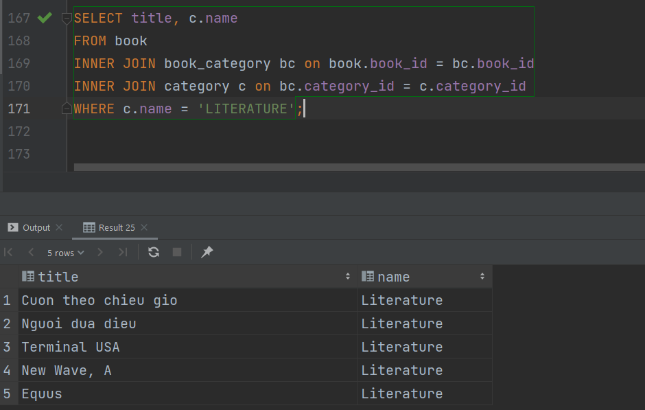
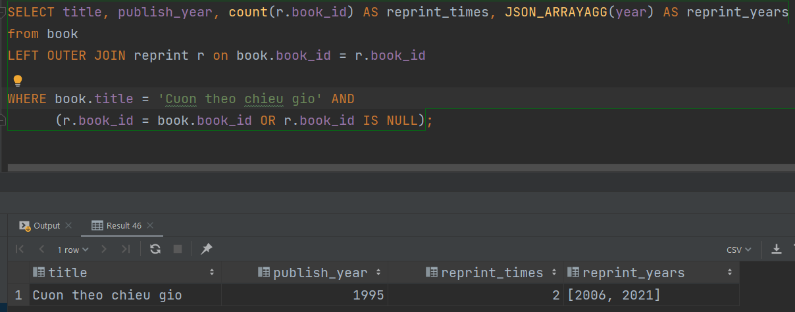
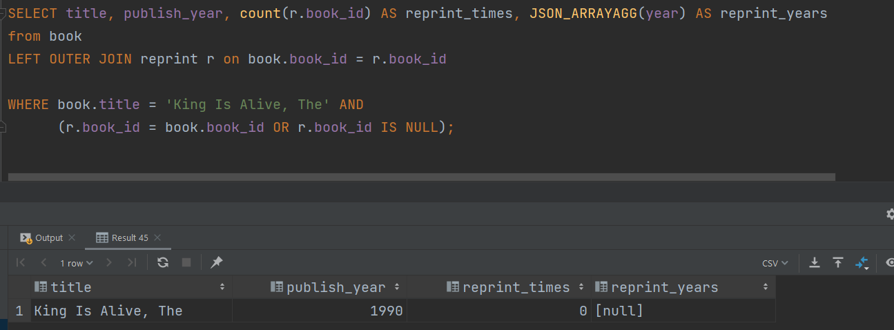
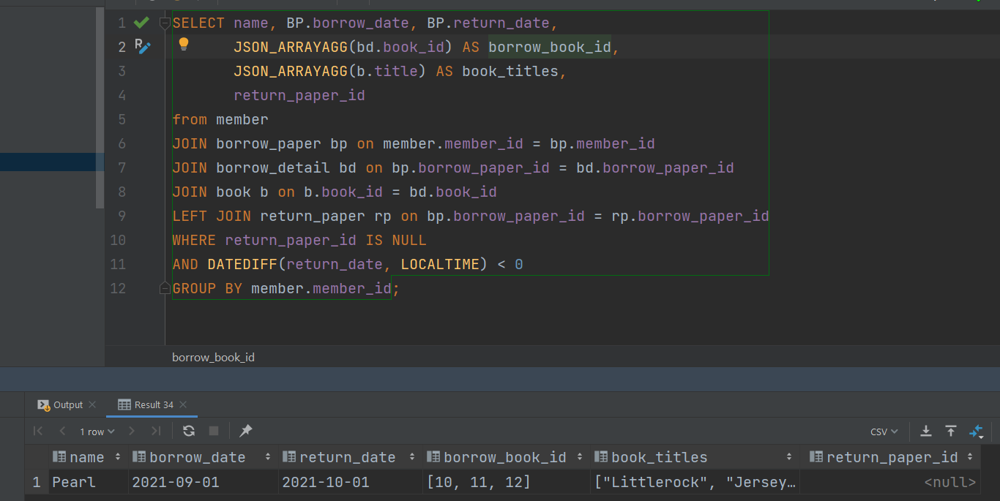

### Library Diagram

1. Liệt kê danh sách độc giả đang mượn sách
- Current borrows  

  
- All time borrows

  
2. Liệt kê các quyển sách thuộc thể loại bất kỳ
- Categories  

  
- Category-search  

  

3. Đưa ra số lần tái bản của quyển sách bất kỳ
- đã tái bản  

  
- chưa tái bản  

  
4. Liệt kê thông tin các độc giả mượn sách nhưng quá hạn trả và id, tên của quyển sách mà độc giả đó đang mượn
- chưa trả  

  
- tất cả  
